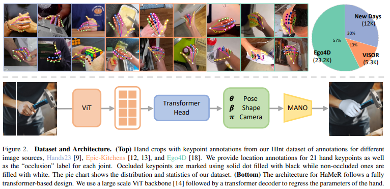
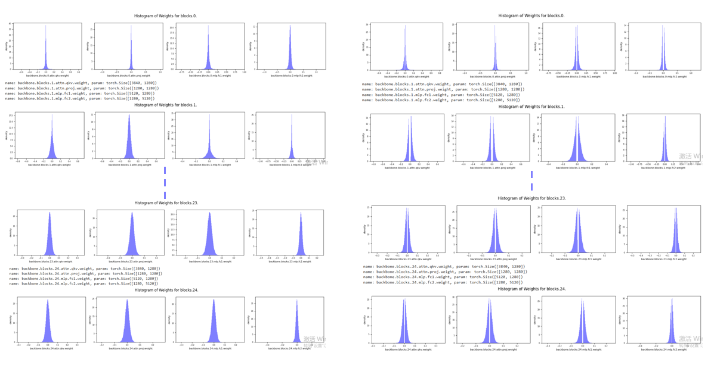
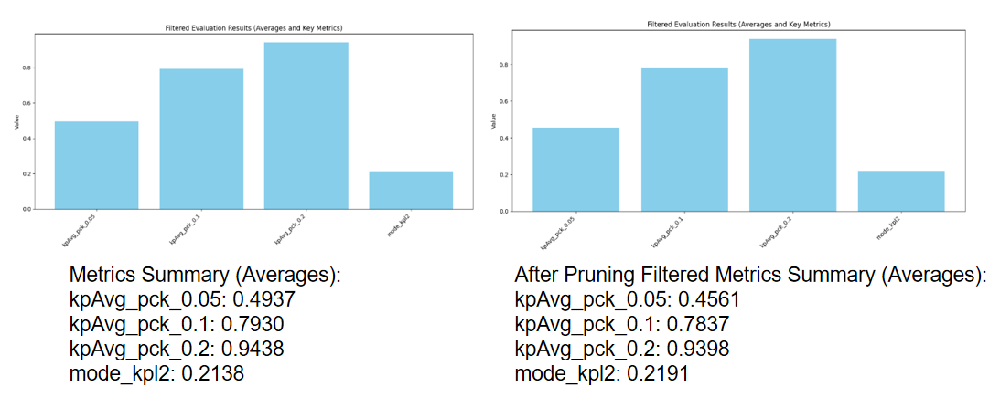

<p align="center">
  
</p>
<!-- Using HTML to center the abstract -->
<div class="columns is-centered has-text-centered">
    <div class="column is-four-fifths">
        <h2>Intro</h2>
        <div class="content has-text-justified">
    The HARM model is renowned for its outstanding performance 
    across various tasks, but its slow inference speed and high 
    computational resource demands pose challenges for deployment
    on resource-constrained devices. This project focuses on optimizing
    the HARM model to reduce inference latency and storage requirements 
    while maintaining high accuracy.
        </div>
    </div>
</div>

---

> Note: This is an example of a Jekyll-based project website template: [Github link](https://github.com/shunzh/project_website).\
> The following content is generated by ChatGPT. The figure is manually added.

## Installation
First you need to clone the repo:
```
git clone --recursive https://github.com/geopavlakos/hamer.git
cd hamer
```

We recommend creating a virtual environment for HaMeR. You can use venv:
```bash
python3.10 -m venv .hamer
source .hamer/bin/activate
```

or alternatively conda:
```bash
conda create --name hamer python=3.10
conda activate hamer
```

Then, you can install the rest of the dependencies. This is for CUDA 11.7, but you can adapt accordingly:
```bash
pip install torch torchvision --index-url https://download.pytorch.org/whl/cu117
pip install -e .[all]
pip install -v -e third-party/ViTPose
```

You also need to download the trained models:
```bash
bash fetch_demo_data.sh
```

Besides these files, you also need to download the MANO model. Please visit the [MANO website](https://mano.is.tue.mpg.de) and register to get access to the downloads section.  We only require the right hand model. You need to put `MANO_RIGHT.pkl` under the `_DATA/data/mano` folder.

The basic environment configuration in the code has been completed above. 
Next, a few additional configurations need to be added for the upcoming quantization functionality.
```bash
pip install torchprofile
pip install fvcore
pip install fast_pytorch_kmeans
```

## HInt Dataset
We have released the annotations for the HInt dataset. Please follow the instructions [here](https://github.com/ddshan/hint)

## Evaluation
Download the [evaluation metadata](https://www.dropbox.com/scl/fi/7ip2vnnu355e2kqbyn1bc/hamer_evaluation_data.tar.gz?rlkey=nb4x10uc8mj2qlfq934t5mdlh) to `./hamer_evaluation_data/`. 

Run evaluation on multiple datasets as follows, results are stored in `results/eval_regression.csv`. 
```bash
python eval.py --dataset 'NEWDAYS-TEST-ALL'
```
* The original paper provides various test datasets to choose from, but we have used only one (NEWDAYS-TEST-ALL)in this case.
- If any issues arise with the configuration, please refer to the original project's documentation[To](https://github.com/geopavlakos/hamer?tab=readme-ov-file).

## Result Show
<p align="center">
  
    <p align="left">The figure above shows the weight distribution of certain parts of the model backbone and the weight distribution after pruning. Due to the large number of blocks in the model, it is not possible to display all of them, so only a subset is shown.
    </p>
</p>
<p align="center">
  
    <p align="left">The figure above presents a comparison of the model's performance and parameters before and after pruning.
    </p>
</p>

<B>After Pruning:</B>

* Inference latency reduced by ~0.013 seconds.
* Slight performance drops observed, with metrics decreasing by up to 0.0376 (kpAvg_pck_0.05).

<B> After Quantization:</B>
* Model size drastically reduced from 2563MB to 3.63MB.
